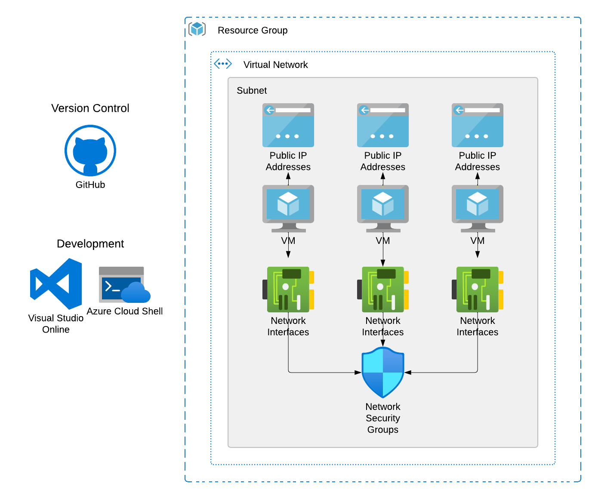

# VM_Vanguard
# Azure Infrastructure Deployment with Bicep

This repository contains Bicep templates for deploying comprehensive Azure infrastructure, including virtual machines, networking resources, and security groups. The goal is to provide a streamlined and scalable solution for cloud resource management using infrastructure-as-code principles.

## Architecture Diagram

## Project Overview

This project implements an infrastructure-as-code approach to provision and manage virtual machines in Azure using ARM templates and Bicep. The aim is to gain hands-on experience in automating the deployment of Azure resources and organizing them efficiently.

### Programming Required
- Knowledge of JSON for ARM templates and Bicep language syntax is essential.

### Azure Services Used
- Azure Virtual Machines
- Azure Resource Manager (ARM)
- Bicep
- Azure Key Vault

### Steps

#### Initial Setup
1. Ensure you have Azure CLI installed with Bicep support.
2. Set up a version control system (e.g., Git) to track changes in your Bicep and ARM templates.

#### Bicep Basics
1. Start with learning the basics of Bicep syntax and structure.
2. Convert a basic ARM template (like one that deploys a single VM) to Bicep to understand the differences.

#### Resource Group and Naming Conventions
1. Define a Bicep file to create an Azure Resource Group for your VMs.
2. Implement naming conventions for your resources using Bicep's string functions.

#### Virtual Machine Provisioning
1. Create a Bicep module for deploying Azure VMs, allowing for parameterized input like VM size, name, and region.
2. Use loops in Bicep to deploy multiple VM instances based on a specified count.

#### Network Resources
1. Design Bicep modules for associated networking resources like Virtual Network, Subnet, and Network Security Groups.
2. Ensure your VMs are provisioned within the designated VNet and have the necessary security rules applied.

#### Network Security Group (NSG) Configuration
1. Define an NSG in your Bicep file with rules to control inbound and outbound traffic.
2. Apply Zero Trust principles by starting with a default deny rule and explicitly allowing necessary traffic from trusted sources.
3. Associate the NSG with the subnet where your VMs are deployed.

#### Using Azure Key Vault
1. Store sensitive information like VM admin usernames and passwords in Azure Key Vault.
2. Reference the secrets stored in Key Vault within your Bicep templates to securely pass them to your resources.

#### Parameter Files and Validation
1. Create separate parameter files for your Bicep templates, allowing for different environment deployments (e.g., dev, test, prod).
2. Use the Azure CLI to validate your Bicep files before deploying, catching any structural errors.

#### Deployment
1. Use the Azure CLI to deploy your Bicep templates, creating all designated resources.
2. Test the reproducibility by deploying the same infrastructure to a different region or resource group.

#### Maintenance & Updates
1. Make changes to your Bicep files (e.g., VM size or count) and redeploy. Observe how Azure handles updates and maintains state.
2. Regularly pull updates to the Bicep language and Azure CLI to stay updated with new features and improvements.

#### Documentation & Cleanup
1. Document your Bicep modules, their purpose, and any parameters required.
2. Clean up any unused resources to avoid unnecessary costs.

## Bicep Modules Overview

### main.bicep
**Purpose**: Orchestrates the deployment of resources using various Bicep modules.

**Parameters**:
- keyVaultName (string): Name of the Key Vault.
- vmCount (int): Number of VMs to deploy.
- location (string): Location for the deployment.
- environment (string): Environment name (e.g., Dev, Test, Prod).

**Modules**:
- network: Deploys networking resources by referencing `network.bicep`.
- vm: Deploys virtual machines by referencing `vm.bicep`.

### network.bicep
**Purpose**: Defines and deploys networking resources such as Virtual Networks, Subnets, and Network Security Groups.

**Parameters**:
- location (string): Location for the deployment.

**Resources**:
- vnet: Creates a virtual network with specified address space and subnets.
- nsg: Creates a network security group with rules to control traffic.

**Outputs**:
- subnetId: The ID of the subnet within the virtual network.

### vm.bicep
**Purpose**: Defines and deploys virtual machines and associated resources.

**Parameters**:
- adminUsername (string): Administrator username for VMs.
- adminPassword (securestring): Administrator password for VMs.
- vmCount (int): Number of VMs to deploy.
- location (string): Location for the deployment.
- subnetId (string): ID of the subnet to which VMs will be attached.

**Resources**:
- publicIp: Creates dynamic public IP addresses for each VM.
- nic: Creates network interfaces, associating them with the public IPs and the designated subnet.
- vm: Deploys virtual machines with specified hardware and software configurations.

## Useful Commands

### Initial Setup
Install Azure CLI with Bicep support:
  az bicep install

### Create a resource group:
az group create --name <ResourceGroupName> --location <Location>
 
### Store secrets in Azure Key Vault:
az keyvault secret set --vault-name <KeyVaultName> --name "DevAdminUsername" --value "dev_admin"

### Validate Bicep files:
az deployment group validate --resource-group <ResourceGroupName> --template-file main.bicep --parameters @dev.parameters.json

### Deploy Bicep templates:
az deployment group create --resource-group <ResourceGroupName> --template-file main.bicep --parameters @dev.parameters.json

### Delete a resource group:
az group delete --name <ResourceGroupName> --yes --no-wait